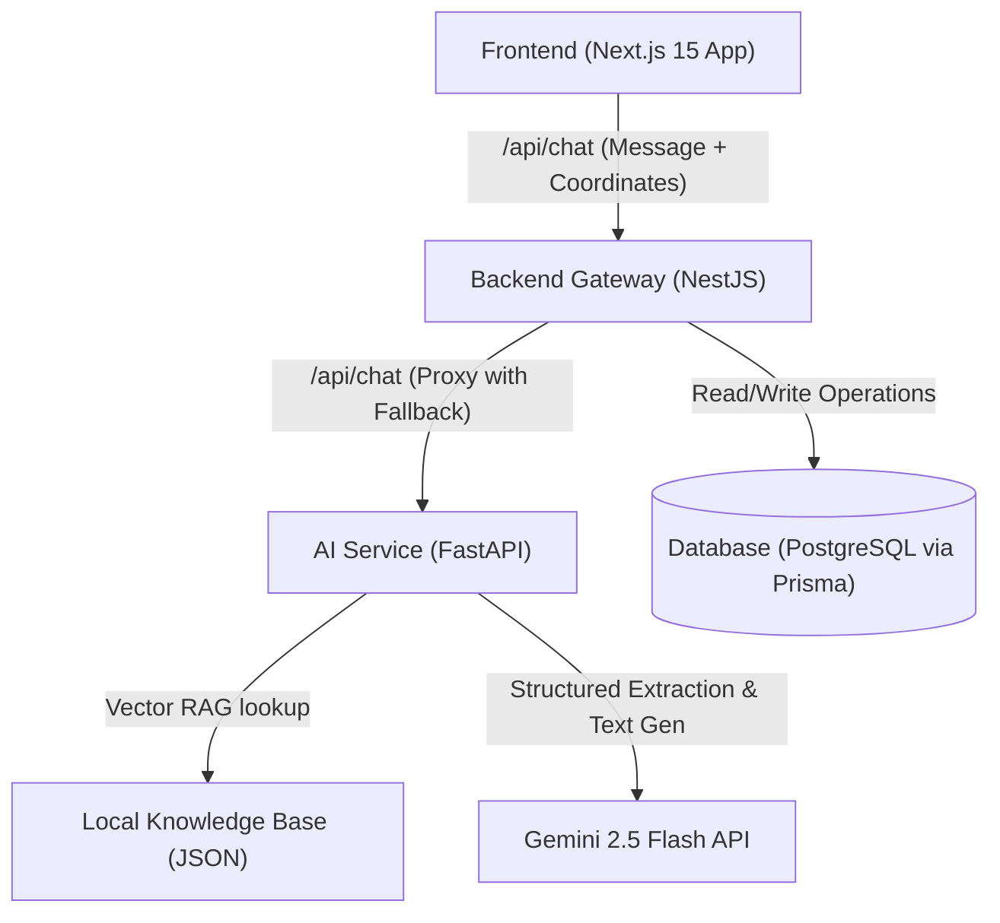

# RAKKU

Responsive Assistant for Knowledge, Kiosk & Citizen Utilities

AI-Powered Citizen Assistance Platform for Police & e-Governance Services

![Next.js]
![NestJS]
![FastAPI]
![Prisma]
![Supabase]
![Docker]
![TypeScript]
![Python]

## Executive Summary

RAKKU is an AI-powered Digital Citizen Assistance Platform designed to simplify access to police and citizen services through natural language conversations.

The platform currently supports:

- Complaint Registration
- Tenant Verification
- Character Certificates
- Event Permissions
- Application Tracking
- Police Station Discovery
- Citizen Guidance & Helpdesk Services

Designed with a modular architecture, RAKKU can operate independently or integrate with future e-Governance systems.

## Table of Contents
- [Executive Summary](#executive-summary)
- [Technology Stack](#technology-stack)
- [Architecture](#architecture)
- [Features](#features)
- [Testing & Quality Assurance](#testing--quality-assurance)
- [Security](#security)
- [Government Integration Roadmap](#government-integration-roadmap)
- [Development Modes](#development-modes)
- [Project Status](#project-status)
- [Version History](#version-history)
- [Contributing](#contributing)
- [License](#license)
- [Contact](#contact)

## Technology Stack

| Layer            | Technology            |
|------------------|-----------------------|
| Frontend         | Next.js 15            |
| Backend          | NestJS                |
| AI Service       | FastAPI               |
| Database         | PostgreSQL / Supabase |
| ORM              | Prisma                |
| Authentication   | Future Integration    |
| Containerization | Docker                |
| AI Models        | Gemini 2.5 Flash      |

## Architecture



**Explanation**

```
Citizen
↓
Next.js Portal
↓
NestJS Gateway
↓
FastAPI AI Engine
↓
Prisma
↓
Supabase/PostgreSQL
```

## File Structure

```text
Rakku-chatbot-v1/
├── docker-compose.yml               # Orchestrates all services
├── .env.example                     # Configuration file template
├── README.md                        # Project documentation
├── shared/
│   ├── message_library.json         # Conversational strings
│   └── officer_persona.md           # Persona guardrails
├── frontend/
│   ├── package.json
│   ├── next.config.js
│   └── src/
│       ├── app/
│       │   ├── chat/
│       │   │   ├── page.tsx
│       │   │   └── components/
│       │   ├── admin/
│       │   └── track/
│       ├── components/
│       │   ├── Header.tsx
│       │   └── Footer.tsx
│       └── services/
│           └── api.ts               # API client
├── backend/
│   ├── package.json
│   ├── tsconfig.json
│   └── src/
│       ├── main.ts                 # NestJS bootstrap
│       ├── chat/
│       │   ├── chat.service.ts
│       │   └── chat.controller.ts
│       ├── validation/
│       │   └── validation.service.ts
│       └── prisma/
│           └── schema.prisma
└── ai-service/
    ├── requirements.txt
    ├── main.py                       # FastAPI entrypoint
    ├── workflow_engine.py            # State machine
    ├── gemini_client.py              # Gemini integration
    └── utils/
        └── helpers.py
```

## Features

### Citizen Services
- Complaint Registration
- Lost Mobile Complaints
- Tenant Verification
- Employee Verification
- Domestic Help Verification
- Character Certificates
- Event Permissions

### Assistance Services
- Police Station Discovery
- Emergency Helplines
- Application Tracking
- Knowledge Assistance

### AI Features
- Multilingual Support
- Workflow Automation
- Citizen Identification
- Smart Validation
- Context Awareness
- Session Recovery (Planned)

## Testing & Quality Assurance

### Master Test Framework (MTF)

Coverage Areas:
- Functional Tests
- Workflow Tests
- Database Tests
- Security Tests
- Stability Tests
- Localization Tests
- Citizen Experience Tests
- Integration Tests

**Current Target**

```
STAGING READY ≥ 90%
```

## Security

- Input Sanitization
- XSS Protection
- Prisma Parameterized Queries
- Session Isolation
- Audit Logging
- Reserved Command Protection

> **Disclaimer:** This prototype does not currently connect to live police databases.

## Government Integration Roadmap

### Future Integration Targets
- UP Police Citizen Portal
- UPCOP Mobile App
- CCTNS
- ICJS
- Digital Police Portal

**Status**

```
Current Stage:
Standalone Demonstration Platform
```

## Development Modes

### Local Development
```bash
npm install
npm run dev
```

### Docker Development
```bash
docker compose up --build
```

### Production Build
```bash
npm run build
```

## Project Status

**Current Phase:** DEMO READY
**Next Milestone:** STAGING READY

**Key Focus Areas:**
- Workflow Parity
- AI Behavior Testing
- Session Recovery
- Security Validation
- Performance Testing

## Version History

| Version | Date | Highlights |
|---------|------|------------|
| v0.1 | Initial Prototype | Core Workflows |
| v0.2 | Citizen Identification | Profile Verification |
| v0.3 | Workflow Parity | FastAPI + NestJS Sync |
| v0.4 | MTF Testing Framework | QA & Stability |

## Contributing

```
Fork
Create Branch
Commit
Push
Open Pull Request
```

## License

MIT License

## Contact

Project Owner: ANURAG PANDEY
Repository: https://github.com/eowanurag/Rakku-chatbot-v1
Email: [EMAIL_ADDRESS]
