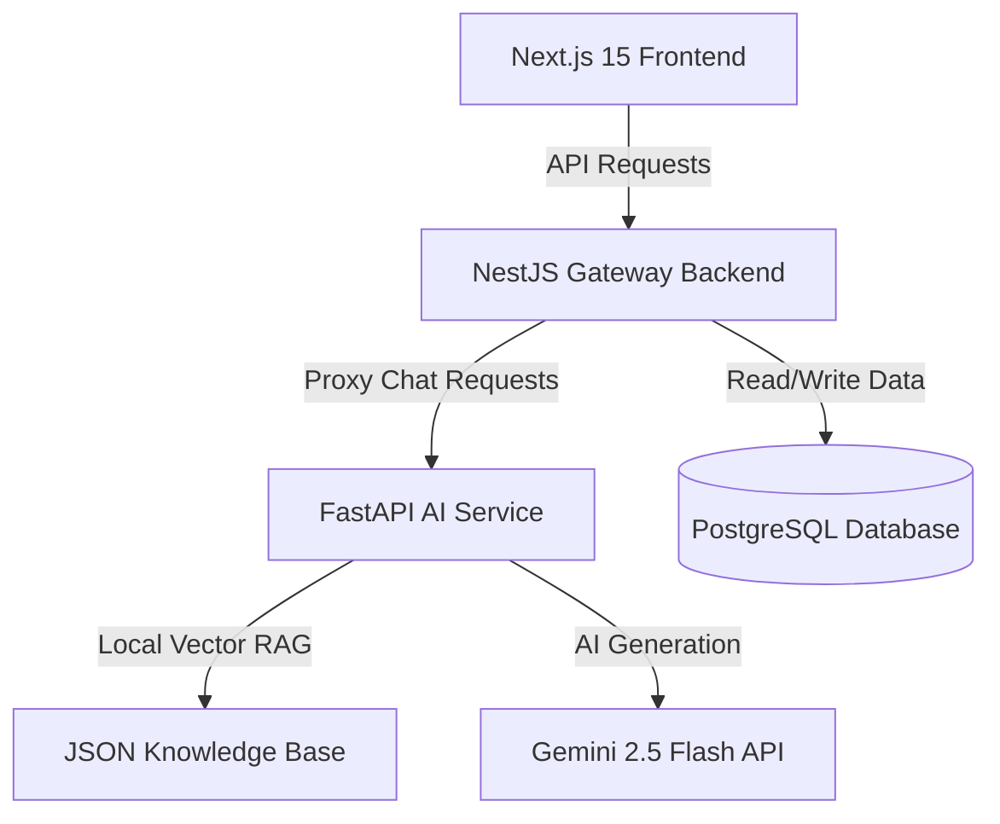

# Rakku – AI-Powered Digital Police Assistant (Prototype)

Rakku is an AI-powered conversational citizen-service assistant prototype designed for **Uttar Pradesh Police Citizen Services**. The assistant helps citizens discover digital services, understand procedures, and navigate workflows (Complaints, Tenant Verification, Character Certificates, Event Permissions) using natural language (supporting English, Hindi, and Hinglish).

It is designed to be fully integrated in the future with:
- UP Police Citizen Portal
- UPCOP Mobile App
- CCTNS ecosystem
- Government APIs

---

## Technical Architecture

The prototype is split into four decoupled layers to support scaling and seamless future migrations:



- **Frontend (`/frontend`):** Next.js 15 app built with TypeScript, Tailwind CSS, and Lucide React. Enforces automatic coordinates lookup and passes them with messages to the backend to support seamless location mapping.
- **Backend (`/backend`):** NestJS gateway API utilizing Prisma ORM to save applications to a PostgreSQL database. Features a dedicated `ValidationService` validating name / mobile formats and local fallbacks.
- **AI Service (`/ai-service`):** FastAPI Python microservice running a slot-filling workflow state machine, Gemini structured information extraction layer, local RAG keyword search engine, and official Google GenAI SDK (Gemini 2.5 Flash).
- **Database (`/db`):** PostgreSQL database storing `Citizen` profiles, `WorkflowSession` states, complaints, verifications, certificates, permissions, and conversation logs.

---

## State Machine & Service Workflows

Rakku supports multiple conversational workflows, each collecting structured parameters via slot-filling state machine paths:

### 1. Citizen Profile Identification
Before entering a target workflow (except Tracking), Rakku verifies the citizen profile:
- **Name Check:** Accepts names (minimum 2 characters, letters only). Single-word names (e.g., "Rahul") are saved; Rakku politely suggests adding a surname but continues without blocking.
- **Mobile Check:** Requires and normalizes a 10-digit Indian mobile number (e.g., normalizes prefix `+91`, `91`, or leading `0`).
- **Location Mapping:** If coordinate attributes (`latitude`/`longitude`) are present, Rakku prompts the user to confirm the auto-detected location (e.g., *"I found your location as: Lucknow. Is this correct?"*) with **Confirm** and **Change Location** options.
- **Natural Language Location Updates:** Users can update their location at any point using statements like *"I live in Kanpur"*, *"Change location to Varanasi"*, *"My district is Prayagraj"*, or *"Location is Noida"*.

### 2. Supported Active Workflows
* **Complaint Registration (`complaint`):**
  * **Fields:** Complaint Type (Lost Mobile, Lost Document, Simple Harassment, Cyber Fraud), Incident Location, Incident Date (DD/MM/YYYY), and Description.
  * **Rejection Prevention:** Validates location consistency relative to profile location and checks for future/invalid dates.
* **Tenant/PG/Help Verification (`verification`):**
  * **Fields:** Verification Type, Candidate Name, Permanent Address, Mobile Number, and Property Details.
* **Character Certificate (`certificate`):**
  * **Fields:** Applicant Name, Permanent Address, District, and Purpose (Job, Passport, Visa, Higher Education, Govt Service).
* **Event Permission (`event`):**
  * **Fields:** Request Type (Event, Procession, Protest, Film Shooting), Event Name, Location/Route, Date, and Expected Attendance.
* **Application Tracking (`tracking`):**
  * **Fields:** Application Reference Number (e.g., `UP-CMP-2026-123456`). Looks up and returns mock real-time application processing timelines.

---

## File Structure

```text
Rakku-chatbot-v1/
├── docker-compose.yml       # Orchestrates all services (DB, Backend, AI, Frontend)
├── .env.example             # Configuration file template
├── README.md                # Project documentation and API reference
│
├── frontend/                # Next.js 15 Web Portal
│   ├── src/
│   │   ├── app/
│   │   │   ├── admin/       # Analytics dashboard for tracking helplines and reports
│   │   │   ├── chat/        # ChatGPT-style digital assistant workspace
│   │   │   ├── components/  # Shared components (e.g. ThemeToggle)
│   │   │   ├── track/       # Application tracking portal with visual timeline
│   │   │   ├── globals.css  # CSS with UP Police navy/crimson/gold theme
│   │   │   ├── layout.tsx   # Global layouts and SEO metadata
│   │   │   └── page.tsx     # Modern government-style homepage with quick actions
│   │   └── services/
│   │       └── api.ts       # Decoupled citizen services API (ready for integrations)
│   ├── Dockerfile
│   └── package.json
│
├── backend/                 # NestJS Gateway API
│   ├── prisma/
│   │   └── schema.prisma    # Prisma PostgreSQL schema mapping
│   ├── src/
│   │   ├── main.ts          # NestJS entrypoint (CORS, Pipes, Prefix)
│   │   ├── app.module.ts    # Binds controllers and services
│   │   ├── prisma.service.ts
│   │   ├── complaint/       # Complaint service & REST controller
│   │   ├── verification/    # Tenant/PG/Domestic Help/Employee verification
│   │   ├── certificate/     # Character certificate service
│   │   ├── event/           # Event, Procession, Protest & Film permissions
│   │   ├── citizen-assistance/ # Nearest police lookup, helplines directory & analytics
│   │   ├── knowledge/       # vector search RAG items retrieval
│   │   ├── templates/       # Conversation responses (empathy, emergency notices)
│   │   ├── tracking/        # Unified status lookup service
│   │   └── chat/            # Chat fallback state machine (chat.service.ts, validation.service.ts)
│   ├── Dockerfile
│   └── package.json
│
└── ai-service/              # FastAPI AI Agent Service
    ├── main.py              # FastAPI app routing, stateless state parsing & health check
    ├── rag_engine.py        # Local JSON RAG matching retriever
    ├── workflow_engine.py   # Slot-filling state machine, profile validation & emergency checks
    ├── gemini_client.py     # Gemini structured profile extraction & prompt templates
    ├── knowledge_base.json  # Local citizen FAQs & official procedures
    ├── Dockerfile
    └── requirements.txt
```

---

## Core Features & Logic Design

### 1. Smart Emergency Intervention (112 Overrides)
Whenever the citizen mentions words related to immediate distress (e.g., *danger*, *assault*, *threat*, *weapon*, *murder*, *kidnapping*, *violence*, *suicide*, *मदद*, *खतरा*, *हमला*, *आग*), Rakku intercepts the conversation flow, cancels active slots, and sends an emergency notice directing them to dial **112** (UP Police Emergency Hotline).

### 2. Multi-Language Support (English, Hindi, Hinglish)
- Intent classification is designed to handle multilingual prompts.
- Statements such as:
  * *"मेरा मोबाइल चोरी हो गया"* (Hindi)
  * *"Phone chori ho gaya"* (Hinglish)
  * *"My phone was stolen"* (English)
  All successfully resolve to the unified `complaint` workflow intent.

### 3. Application Readiness Validation & Scoring
On completing any flow, Rakku displays the pre-submission review screen showing the checklist and **Readiness Score (0-100)**:
- **✓ Profile Valid** (25 pts)
- **✓ Mobile Valid** (25 pts)
- **✓ Location Confirmed** (25 pts)
- **✓ Required Fields Complete** (25 pts)

If any check fails or is missing, the score is below 100, and Rakku blocks the submission option, requesting the citizen to correct or complete the missing fields.

### 4. Formatting Prevention Layer
If a validation check fails (such as an incorrect date format or location mismatch), Rakku behaves as a helpful citizen assistance officer:
- Explains the exact issue and provides an example format (e.g., *DD/MM/YYYY*).
- Preserves all previously entered session fields so the citizen does not have to restart the workflow.

---

## Quick Start (Docker Compose)

The easiest way to run the entire prototype (PostgreSQL, NestJS, FastAPI, and Next.js) is via Docker Compose:

### 1. How to Start Rakku

1. **Clone the repository** and open the root folder.
2. **Create a `.env` file** based on the `.env.example`:
   ```bash
   cp .env.example .env
   ```
3. **Configure your Gemini API Key** inside `.env`:
   ```env
   GEMINI_API_KEY=AIzaSy...
   ```
4. **Start the containers** in detached background mode (or foreground using `docker compose up --build`):
   ```bash
   docker compose up -d --build
   ```
5. **Access the services:**
   - Next.js Web Portal: `http://localhost:3000`
   - NestJS Backend Gateway: `http://localhost:3001/api`
   - FastAPI AI Service: `http://localhost:8000/health`
   - PostgreSQL Database: `localhost:5432`

### 2. How to Stop Rakku

To stop the containers and free up resources:
- **Stop containers (keeping data):**
  ```bash
  docker compose stop
  ```
- **Stop and remove containers/networks:**
  ```bash
  docker compose down
  ```
- **Stop and remove containers, networks, and database volumes (complete reset):**
  ```bash
  docker compose down -v
  ```

---

## Auditing, Validation & Modification Enhancements

We have recently integrated the following digital citizen officer features:
1. **Unicode Name & Single Name Support**: Accepts Hindi Unicode characters (e.g., `राज`, `मोहन सिंह`) and single names (e.g., `Rahul`). Prompts confirming low confidence names (`CONFIRM_NAME` step) and suggests surname formats politely.
2. **Citizen Address Slot-Filling**: Structured address segments (`addressLine1`, `addressLine2`, `pincode`) are parsed out of free text inputs in the `IDENTIFY_ADDRESS` step and stored alongside location fields.
3. **Single Field Modification screens**: Clicking `Modify Details` on the review card initiates `MODIFY_SELECT` and `MODIFY_INPUT` flows to adjust a specific field instead of restarting the entire form.
4. **PostgreSQL Event Auditing**: Every key state transition, validation outcome, modification, and final submission is pushed as a structured row to the `AuditLog` table using Prisma.
5. **Advanced Application Tracking System**:
   * **Workflow Bypass**: Tracking is executed as a direct read-only query bypassing workflow state machines. The tracker takes the reference number, parses it, matches the database, and returns the response immediately without any review, modify, or submit states.
   * **Timeline History Support**: The `TrackingRecord` model contains a `statusHistory` JSON array storing transitions (e.g., `SUBMITTED`, `UNDER_REVIEW`, `PENDING_VERIFICATION`, `APPROVED`, `REJECTED`, `CLOSED`) with UTC timestamps. If status history exists, the user is presented with a complete visual timeline:
     ```text
     ✓ Submitted
     08 Jun 2026

     ✓ Under Review
     09 Jun 2026
     ```
   * **Unified Source of Truth**: The `TrackingService` queries `TrackingRecord` exclusively. Workflow submissions create/update this record.
6. **Lost Mobile / Theft Complaint Flow Details**:
   * **Dynamic Slot-Filling**: Appends phone-specific fields (`mobileBrand`, `mobileModel`, `mobileColor`, `purchaseYear`, `imeiNumber`) to the complaint flow when the type is `"Lost Mobile / Theft"`.
   * **IMEI Guidance Dialogue**: Prompts with guidance showing where to find the IMEI:
     > Do you know your IMEI number?
     > You can usually find it:
     > • On the phone box
     > • On the purchase invoice
     > • By dialing *#06# if the device is available
     > If you do not have it, type: **Skip**
   * **Bypass Inputs**: Accepts `skip`, `none`, `not available`, `i don't know`, and `no` as non-blocking values to proceed with the report.
7. **Structured Reference Numbers**: Generates and persists consistent reference numbers across tracking, service tables, and logs:
   * **Complaints**: `UP-CMP-2026-XXXXXX`
   * **Tenant Verification**: `UP-TV-2026-XXXXXX`
   * **Character Certificate**: `UP-CC-2026-XXXXXX`
   * **Event Permission**: `UP-EP-2026-XXXXXX`
8. **Robust Citizen Verification Continuation**:
   * Stales and handles natural language corrections during citizen profile identification.
   * Automatically resumes the pending workflow (e.g. Complaint, Verification, Certificate, Event) without resetting states or printing `undefined` outputs. Includes a safety fallback asking the user how they would like to be assisted if no workflow matches.


## Self-Learning & Citizen Intelligence Platform

Rakku has been upgraded to a continuously improving Citizen Intelligence Platform. Rather than automatically self-modifying its prompts or workflows, Rakku logs citizen interactions, feedback, sentiments, and intent patterns to generate actionable insights and recommendations for administrators.

### 1. Database Analytics Schema
The Postgres database (`schema.prisma`) incorporates the following metrics and analytics models:
- **`ConversationInsight`**: Tracks query classification accuracy, intent confidence scores, and preferred user languages.
- **`ConversationSentiment`**: Logs sentiment metrics (positive, neutral, negative) mapped to conversation sessions.
- **`Feedback`**: Stores citizen satisfaction ratings (thumbs up/down) and qualitative feedback.
- **`UnansweredQuestion`**: Captures user queries that couldn't be answered to build new RAG knowledge articles.
- **`IntentTrainingData`**: Collects suggested training phrases for admin review.
- **`WorkflowAnalytics`**: Monitors workflow starts, steps completed, drop-offs, and completion times.
- **`CitizenPreference`**: Records preferred languages and districts by session.
- **`KnowledgeCategory` & `KnowledgeArticle`**: Admin-managed RAG database supporting categories and status controls.
- **`LearningEvent`**: Audit trail of admin actions (e.g., publishing articles, modifying intents).
- **`AggregatedMetric`**: Aggregates daily key metrics (total conversations, average sentiment, resolution rates).

### 2. NestJS Intelligence API Routes
- **`GET /api/intelligence/metrics`**: Returns current high-level analytics (sentiment distribution, satisfaction rate, intent accuracy).
- **`GET /api/intelligence/dashboard`**: Returns detailed metrics including top intents, drop-off rates by workflow, preferred languages/districts, and unresolved questions.
- **`POST /api/intelligence/feedback`**: Stores direct citizen rating (`👍 Yes` or `👎 No`) with feedback comment.
- **`POST /api/intelligence/aggregate`**: Triggers calculations for aggregated daily reporting metrics.
- **`POST /api/intelligence/knowledge`**: Interface to add categories and articles for learning validation.

### 3. Admin Intelligence Portal
Accessible at `/admin-intelligence`, the dashboard provides a modern web interface displaying:
- **Interactive Metrics Cards**: Conversational volumes, satisfaction rates, and average confidence scores.
- **Drop-off Analysis**: Funnel representation of slot-filling progress to isolate where citizens abandon workflows.
- **Unresolved & Hindi/Hinglish Query Reviews**: Visual listing of queries that require additional database or intent training.
- **District and Language Hotspots**: Insights on which geographic regions (UP Districts) and language preferences dominate citizen engagement.

## Local Setup (Manual Run)

If you don't have Docker installed, you can start the Node.js services directly. 

*(Note: If the FastAPI service is not running, the NestJS backend automatically switches to its local TypeScript rule-based state machine fallback, ensuring the entire chat interface remains functional).*

### 1. Database & NestJS Backend Setup
```bash
cd backend
npm install
# Configure DATABASE_URL in a local .env file
# Run Prisma migrations to initialize PostgreSQL
npx prisma db push --force-reset
# Generate prisma client types
npm run prisma:generate
# Start backend in development watch mode
npm run start:dev
```
*Runs at `http://localhost:3001`.*

### 2. Next.js Frontend Setup
```bash
cd frontend
npm install
# Start dev server
npm run dev
```
*Runs at `http://localhost:3000`.*

### 3. FastAPI AI Service Setup (Requires Python 3.10+)
```bash
cd ai-service
pip install -r requirements.txt
# Set GEMINI_API_KEY in environment or .env
uvicorn main:app --host 0.0.0.0 --port 8000 --reload
```
*Runs at `http://localhost:8000`.*

---

## API Reference

### 1. Chat Assistant Endpoint
* **`POST /api/chat`**
  * **Payload:** `{ "message": "My phone was stolen", "sessionId": "sess-abc", "latitude": 26.8467, "longitude": 80.9462 }`
  * **Response:** `{ "response": "📋 [Confirmation Card]... Is everything correct?", "suggestions": ["Confirm Details", "Modify Details"], "state": { ... } }`
