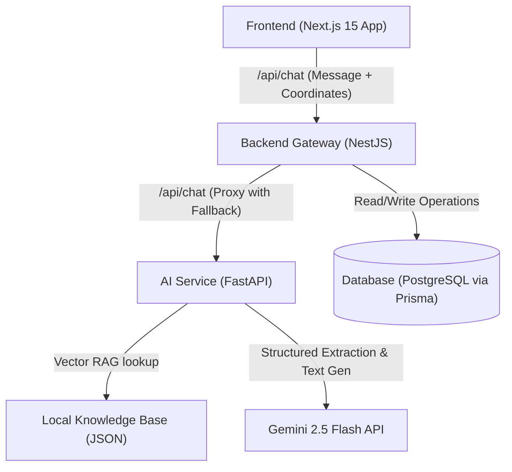

# RAKKU

Responsive Assistant for Knowledge, Kiosk & Citizen Utilities

AI-Powered Citizen Assistance Platform for Police & e-Governance Services

![Next.js]
![NestJS]
![FastAPI]
![Prisma]
![Supabase]
![Docker]
![TypeScript]
![Python]

## Executive Summary

RAKKU is an AI-powered Digital Citizen Assistance Platform designed to simplify access to police and citizen services through natural language conversations.

The platform currently supports:

- Complaint Registration
- Tenant Verification
- Character Certificates
- Event Permissions
- Application Tracking
- Police Station Discovery
- Citizen Guidance & Helpdesk Services

Designed with a modular architecture, RAKKU can operate independently or integrate with future e-Governance systems.

## Table of Contents
- [Executive Summary](#executive-summary)
- [Technology Stack](#technology-stack)
- [Architecture](#architecture)
- [Features](#features)
- [Testing & Quality Assurance](#testing--quality-assurance)
- [Security](#security)
- [Government Integration Roadmap](#government-integration-roadmap)
- [Development Modes](#development-modes)
- [Project Status](#project-status)
- [Version History](#version-history)
- [Contributing](#contributing)
- [License](#license)
- [Contact](#contact)

## Technology Stack

| Layer            | Technology            |
|------------------|-----------------------|
| Frontend         | Next.js 15            |
| Backend          | NestJS                |
| AI Service       | FastAPI               |
| Database         | PostgreSQL / Supabase |
| ORM              | Prisma                |
| Authentication   | Future Integration    |
| Containerization | Docker                |
| AI Models        | Gemini 2.5 Flash      |

## Architecture



**Explanation**

```
Citizen
↓
Next.js Portal
↓
NestJS Gateway
↓
FastAPI AI Engine
↓
Prisma
↓
Supabase/PostgreSQL
```

## File Structure

```text
Rakku-chatbot-v1/
├── docker-compose.yml               # Docker configuration
├── .env.example                     # Environment variables template
├── README.md                        # Project documentation
├── COMPREHENSIVE_GUIDE.md           # Developer onboarding guide
├── shared/
│   ├── message_library.json         # All conversational strings
│   ├── officer_persona.md           # Persona guardrails for the AI
│   └── jurisdiction-data/           # 75 UP districts metadata
├── frontend/
│   ├── package.json                 # Frontend dependencies
│   ├── next.config.js               # Next.js configuration
│   ├── tailwind.config.js           # Tailwind CSS config
│   ├── tsconfig.json                # TypeScript config
│   └── src/
│       ├── app/
│       │   ├── chat/
│       │   │   └── page.tsx         # Chat page component
│       │   ├── admin/               # Admin dashboard components
│       │   ├── track/               # Application tracking UI
│       │   └── dashboard/           # Citizen Services Hub
│       ├── components/
│       │   ├── chat/
│       │   │   ├── ChatBubble.tsx
│       │   │   ├── TypingIndicator.tsx
│       │   │   └── ActionButtonGroup.tsx
│       │   ├── dashboard/
│       │   │   ├── ApplicationCard.tsx
│       │   │   └── ServiceCard.tsx
│       │   ├── review/
│       │   │   ├── ApplicantReviewCard.tsx
│       │   │   ├── ServiceReviewCard.tsx
│       │   │   └── ValidationStatusCard.tsx
│       │   └── ui/
│       │       └── StatusBadge.tsx
│       └── services/
│           └── api.ts               # API client wrapper
├── backend/
│   ├── package.json                 # Backend dependencies
│   ├── tsconfig.json                # TypeScript config
│   ├── prisma/
│   │   └── schema.prisma            # Prisma data model
│   └── src/
│       ├── main.ts                  # NestJS bootstrap
│       ├── chat/
│       │   ├── chat.service.ts      # Chat fallback logic
│       │   └── chat.controller.ts   # Chat HTTP endpoints
│       ├── security/
│       │   ├── rate-limiter/        # Rate limiting logic
│       │   └── fingerprint/         # DB-backed fingerprint guard
│       └── jurisdiction-routing/    # 75-district router
└── ai-service/
    ├── requirements.txt             # Python dependencies
    ├── main.py                      # FastAPI entrypoint
    ├── workflow_engine.py           # Slot-filling state machine
    ├── gemini_client.py             # Gemini API client
    ├── rag_engine.py                # Local Vector RAG search
    ├── knowledge_base.json          # Policy/FAQ database
    └── Dockerfile                   # Docker container configuration
```

## Features

### Citizen Services
- Complaint Registration
- Lost Mobile Complaints
- Tenant Verification
- Employee Verification
- Domestic Help Verification
- Character Certificates
- Event Permissions

### Assistance Services
- Police Station Discovery
- Emergency Helplines
- Application Tracking
- Knowledge Assistance

### AI & UI Persona Features
- **Inspector Rakku Identity**: Fully integrated official UP Police digital persona conforming to strict citizen-friendly guidelines.
- **Dynamic Avatar States**: Support for 12 conversational avatar poses (Salute, Welcome, Namaste, Idle, Thinking, Talking, Pointing, Completed, Success, Emergency, Goodbye, Error).
- **Persistent Assistant Panel**: Sticky desktop side-panel and responsive mobile header featuring large animated avatars, directional speech bubbles, and online status indicators.
- **Custom CSS Animations**: Gentle idle float, soft thinking pulse, success bounce, and pulsing emergency outline effects.
- **State Machine Sequences**: Automatically handles complex welcome experience state flows and timed auto-idle transitions.
- **Multilingual Support**: Supports English, Hindi, and Hinglish.
- **Workflow Automation & Smart Validation**: In-context slot filling and validations.
- **Profile Reuse Protocol (PRP)**: A generic engine (`handleProfileReuseProtocol`) mapping verified Citizen profiles to target service roles (e.g. Subject or Organizer) to eliminate redundant inputs while preserving database isolation for third-party submissions. Enforces high-contrast UI review cards, dynamic profile source badges (`Verified Profile` or `Manual Entry`), and screen reader live accessibility announcements (`Announcements.announce`) vocalizing pre-fill triggers.
- **Feedback Intelligence**: Supports multi-category feedback collection (e.g. PERFORMANCE, ACCESSIBILITY, CLARITY, ACCURACY, OTHER) with matching FastAPI backend/NestJS fallback processing, rating pipelines, and frontend verification.
- **Jurisdiction Dataset Coverage**: Fully maps all 75 Uttar Pradesh districts. Validates data integrity on system boot.
- **Placeholder Routing UX**: Masks GPS coordinates, phone numbers, and maps URLs for unverified district placeholders and presents a provisional routing notice.

## Testing & Quality Assurance

### Master Test Framework (MTF)

Coverage Areas:
- Functional Tests
- Workflow Tests
- Database Tests (Prisma & Supabase migrations)
- Security Tests (Rate Limiting, SQL injection, XSS, Payload Limits, Duplicate Submissions)
- Stability Tests
- Localization Tests
- Citizen Experience Tests
- Integration Tests

**Current Target**

```
V1 PRODUCTION READY - 100% Score Passed
```

### Frontend Reliability Validation

- [x] Verify that UI components render correctly on Desktop (1080p), Tablet (768px), and Mobile (360px).
- [x] Ensure `useSessionPersistence` successfully retains chat history across page reloads.
- [x] Confirm `ErrorBoundary` catches rendering errors gracefully and shows fallback UI.
- [x] Test status badges for all states (Submitted, Under Review, Approved, Rejected, etc.) to ensure proper color coding.
- [x] Check responsive layout on the Dashboard Quick-Actions Grid.

## Security & Abuse Protection

- **Tiered Rate Limiting**: Global throttling (60 requests/min) and strict throttling (15 requests/min) on critical endpoints (chat, feedback, event, jurisdiction lifecycle) with Express proxy IP extraction.
- **Persistent Submission Fingerprinting**: DB-backed SHA256 deterministic hash checks preventing duplicate forms within a 5-minute window. Includes a 24-hour automatic startup cleanup task.
- **Payload Constraints**: Express JSON and URL-encoded limits set to `1MB` to prevent memory flooding.
- **Input Sanitization**: XSS and SQL Injection validation and filtering.
- **Prisma Parameterized Queries**: Out-of-the-box protection from SQL Injection vectors.
- **Session Isolation & Audit Logging**: Step-level auditing and tracing of workflow paths.

> **Disclaimer:** This prototype does not currently connect to live police databases.

## Government Integration Roadmap

### Future Integration Targets
- UP Police Citizen Portal
- UPCOP Mobile App
- CCTNS
- ICJS
- Digital Police Portal

**Status**

```
Current Stage:
Standalone Demonstration Platform
```

## Development Modes

### Local Development
```bash
npm install
npm run dev
```

### Docker Development
```bash
docker compose up --build
```

### Production Build
```bash
npm run build
```

## Project Status

**Current Phase:** V1 PRODUCTION READY (100% Verification Score)
**Next Milestone:** Production Deployment & Monitoring

**Key Focus Areas:**
- Horizontal scaling validations on Render
- Production database monitoring (Supabase)
- Real-time LLM logging and telemetry

## Version History

| Version | Date | Highlights |
|---------|------|------------|
| v0.1 | Initial Prototype | Core Workflows |
| v0.2 | Citizen Identification | Profile Verification |
| v0.3 | Workflow Parity | FastAPI + NestJS Sync |
| v0.4 | MTF Testing Framework | QA & Stability |
| v0.5 | 2026-06-14 | Profile Reuse Protocol (PRP) Engine & Schema Upgrades |
| v1.0-RC1 | 2026-06-14 | Rate Limiting, Fingerprint Lifecycle, 75 District Coverage, Placeholder UX Masking, Operational Validation |
| v1.0-RC2 | 2026-06-15 | PRP Hardening: Review cards, source badges, screen reader announcements, and 6 dedicated integration tests |
| v1.0-RC3 | 2026-06-15 | Feedback Intelligence: Category mapping alignment, rating pipelines, and 8 dedicated integration tests |
| v1.0 | 2026-06-15 | V1 Production Ready: Release Candidate Audit, Localization Parity Hardening, and full-system verification |

## Contributing

```
Fork
Create Branch
Commit
Push
Open Pull Request
```

## License

MIT License

## Contact

Project Owner: ANURAG PANDEY
Repository: https://github.com/eowanurag/Rakku-chatbot-v1
Email: [EMAIL_ADDRESS]
