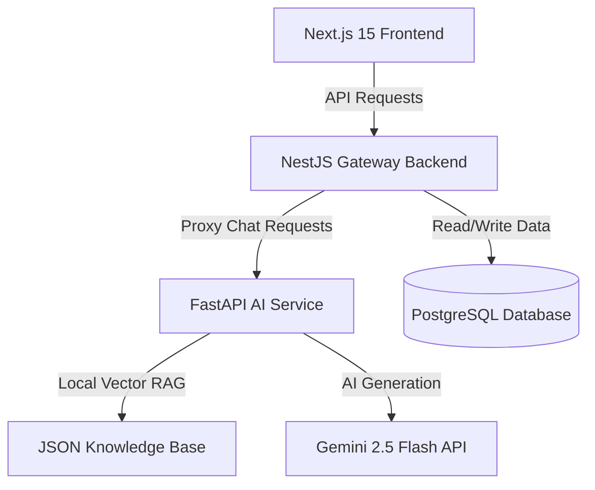

# Rakku – AI-Powered Digital Police Assistant (Prototype)

Rakku is an AI-powered conversational citizen-service assistant prototype designed for **Uttar Pradesh Police Citizen Services**. The assistant helps citizens discover digital services, understand procedures, and navigate workflows (Complaints, Tenant Verification, Character Certificates, Event Permissions) using natural language (supporting English, Hindi, and Hinglish).

It is designed to be fully integrated in the future with:
- UP Police Citizen Portal
- UPCOP Mobile App
- CCTNS ecosystem
- Government APIs

---

## Technical Architecture

The prototype is split into four decoupled layers to support scaling and seamless future migrations:



- **Frontend (`/frontend`):** Next.js 15 app built with TypeScript, Tailwind CSS, and Lucide React icons. Features a ChatGPT-style conversational pane and tracking search timeline.
- **Backend (`/backend`):** NestJS gateway API utilizing Prisma ORM to save applications to a PostgreSQL database. Features dynamic service interfaces and a TypeScript-based fallback workflow engine.
- **AI Service (`/ai-service`):** FastAPI Python microservice running a slot-filling workflow state machine, local RAG keyword search engine, and official Google GenAI SDK (Gemini 2.5 Flash).
- **Database (`/db`):** PostgreSQL database storing complaints, verifications, certificates, permissions, and conversation logs.

---

## File Structure

```text
Rakku-chatbot-v1/
├── docker-compose.yml       # Orchestrates all services (DB, Backend, AI, Frontend)
├── .env.example             # Configuration file template
├── README.md                # Project documentation and API reference
│
├── frontend/                # Next.js 15 Web Portal
│   ├── src/
│   │   ├── app/
│   │   │   ├── chat/        # ChatGPT-style digital assistant workspace
│   │   │   ├── track/       # Application tracking portal with visual timeline
│   │   │   ├── globals.css  # CSS with UP Police navy/crimson/gold theme
│   │   │   ├── layout.tsx   # Global layouts and SEO metadata
│   │   │   └── page.tsx     # Modern government-style homepage with quick actions
│   │   └── services/
│   │       └── api.ts       # Decoupled citizen services API (ready for integrations)
│   ├── Dockerfile
│   └── package.json
│
├── backend/                 # NestJS Gateway API
│   ├── prisma/
│   │   └── schema.prisma    # Prisma PostgreSQL schema model mappings
│   ├── src/
│   │   ├── main.ts          # NestJS entrypoint (CORS, Pipes, Prefix)
│   │   ├── app.module.ts    # Binds controllers and services
│   │   ├── prisma.service.ts
│   │   ├── complaint/       # Complaint service & REST controller
│   │   ├── verification/    # Tenant/PG/Domestic Help/Employee verification
│   │   ├── certificate/     # Character certificate service
│   │   ├── event/           # Event, Procession, Protest & Film permissions
│   │   ├── tracking/        # Unified status lookup service
│   │   └── chat/            # Chat proxy (with built-in TS mock engine fallback)
│   ├── Dockerfile
│   └── package.json
│
└── ai-service/              # FastAPI AI Agent Service
    ├── main.py              # FastAPI app routing & health check
    ├── rag_engine.py        # Local JSON RAG matching retriever
    ├── workflow_engine.py   # Slot-filling state machine & emergency checks
    ├── gemini_client.py     # Gemini 2.5 Flash SDK prompt engineering
    ├── knowledge_base.json  # Local citizen FAQs & official procedures
    ├── Dockerfile
    └── requirements.txt
```

---

## Quick Start (Docker Compose)

The easiest way to run the entire prototype (PostgreSQL, NestJS, FastAPI, and Next.js) is via Docker Compose:

1. **Clone the repository** and open the root folder.
2. **Create a `.env` file** based on the `.env.example`:
   ```bash
   cp .env.example .env
   ```
3. **Configure your Gemini API Key** inside `.env`:
   ```env
   GEMINI_API_KEY=AIzaSy...
   ```
4. **Build and start the container network:**
   ```bash
   docker compose up --build
   ```
5. **Access the services:**
   - Next.js Web Portal: `http://localhost:3000`
   - NestJS Backend Gateway: `http://localhost:3001/api`
   - FastAPI AI Service: `http://localhost:8000/health`
   - PostgreSQL Database: `localhost:5432`

---

## Local Setup (Manual Run)

If you don't have Docker installed, you can start the Node.js services directly. 

*(Note: If the FastAPI service is not running, the NestJS backend automatically switches to its local TypeScript rule-based state machine, ensuring the entire chat interface remains functional).*

### 1. Database & NestJS Backend Setup
```bash
cd backend
npm install
# Configure DATABASE_URL in a local .env file
# Run Prisma migrations to initialize PostgreSQL
npx prisma db push
# Generate prisma client types
npm run prisma:generate
# Start backend in development watch mode
npm run start:dev
```
*Runs at `http://localhost:3001`.*

### 2. Next.js Frontend Setup
```bash
cd frontend
npm install
# Start dev server
npm run dev
```
*Runs at `http://localhost:3000`.*

### 3. FastAPI AI Service Setup (Requires Python 3.10+)
```bash
cd ai-service
pip install -r requirements.txt
# Set GEMINI_API_KEY in environment or .env
uvicorn main:app --host 0.0.0.0 --port 8000 --reload
```
*Runs at `http://localhost:8000`.*

---

## API Reference

### 1. Chat Assistant Endpoint
* **`POST /api/chat`**
  * **Payload:** `{ "message": "My phone was stolen", "sessionId": "sess-abc" }`
  * **Response:** `{ "response": "📋 [Complaint Form]... Please select Complaint Type:", "suggestions": ["Lost Mobile / Theft", "Lost Document"] }`

### 2. Complaint Module
* **`POST /api/complaint`**: Submits a new complaint draft.
  * **Payload:** `{ "type": "Lost Mobile", "details": "iPhone stolen at Lucknow station on 05/06" }`
  * **Response:** Returns complaint object with generated `referenceNumber` (e.g. `UP-CMP-2026-124982`).
* **`PUT /api/complaint/:refNum`**: Modifies details of an existing complaint.
* **`GET /api/complaint/:refNum`**: Fetches complaint status and details.

### 3. Verification Module
* **`POST /api/verification`**: Registers Tenant/PG/Domestic Help/Employee details.
  * **Payload:** `{ "type": "Tenant", "name": "Rahul Sharma", "address": "Indira Nagar, Lucknow", "mobile": "9876543210", "propertyDetails": "Flat 302" }`
  * **Response:** Returns verification object with generated `referenceNumber` (e.g. `UP-VER-2026-857214`).
* **`GET /api/verification/:refNum`**: Fetches application status.

### 4. Character Certificate Module
* **`POST /api/certificate`**: Files character check request.
  * **Payload:** `{ "name": "Aman Verma", "address": "Hazratganj", "district": "Lucknow", "purpose": "Private Employment" }`
  * **Response:** Returns certificate object with generated `referenceNumber` (e.g. `UP-CER-2026-641203`).
* **`GET /api/certificate/:refNum`**: Fetches status.

### 5. Event Permission Module
* **`POST /api/event`**: Registers event, procession, protest, or film request.
  * **Payload:** `{ "type": "Protest Request", "eventName": "Peaceful Rally", "location": "1090 Crossing to Hazratganj", "date": "10/06/2026", "expectedAttendance": 200 }`
  * **Response:** Returns permission object with generated `referenceNumber` (e.g. `UP-EVP-2026-724185`).
* **`GET /api/event/:refNum`**: Fetches status.

### 6. Tracking Module
* **`GET /api/tracking/:refNum`**
  * **Response:** `{ "referenceNumber": "UP-CMP-2026-124982", "serviceType": "Complaint Registration", "status": "Under Review", "updatedAt": "2026-06-05T12:00:00Z", "details": { ... } }`

---

## Demo Scenarios

Test the prototype using these three simulation scenarios in the Chat panel:

1. **Scenario 1: Lost Phone Complaint**
   * *User:* "My phone was stolen."
   * *Rakku:* Detects intent, locks Complaint workflow, and prompts for "Complaint Type" (recommends options in chips). Follows up by collecting incident details, then returns a mock complaint code `UP-CMP-2026-XXXXXX`.
2. **Scenario 2: Tenant Verification (Hindi)**
   * *User:* "मुझे किरायेदार सत्यापन कराना है"
   * *Rakku:* Detects language (Hindi), locks Verification workflow, and conducts form-filling in Hindi. Asks for Name, Address, Mobile, and Property details one-by-one, and returns reference code `UP-VER-2026-XXXXXX`.
3. **Scenario 3: Character Certificate**
   * *User:* "I need a character certificate for a job."
   * *Rakku:* Locks Character Certificate workflow, gathers Name, Address, District, and Purpose, then displays a success report.
4. **Emergency Handler:**
   * *User:* "Burglars are breaking into my house right now!"
   * *Rakku:* Detects emergency trigger and overrides any active workflow to display the emergency helpline banner: **"This appears to be an emergency. Please contact UP Police emergency services immediately by dialing 112."**
