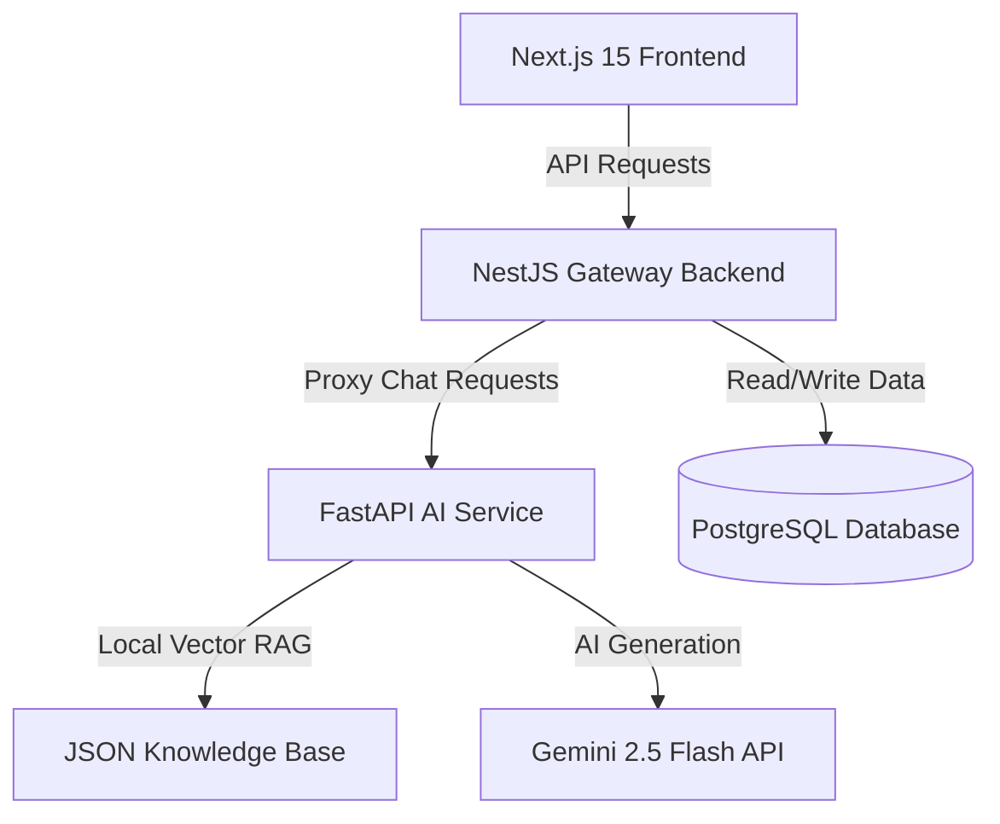

# Rakku – AI-Powered Digital Police Assistant (Prototype)

Rakku is an AI-powered conversational citizen-service assistant prototype designed for **Uttar Pradesh Police Citizen Services**. The assistant helps citizens discover digital services, understand procedures, and navigate workflows (Complaints, Tenant Verification, Character Certificates, Event Permissions) using natural language (supporting English, Hindi, and Hinglish).

It is designed to be fully integrated in the future with:
- UP Police Citizen Portal
- UPCOP Mobile App
- CCTNS ecosystem
- Government APIs

---

## Technical Architecture

The prototype is split into four decoupled layers to support scaling and seamless future migrations:



- **Frontend (`/frontend`):** Next.js 15 app built with TypeScript, Tailwind CSS, and Lucide React. Enforces automatic coordinates lookup and passes them with messages to the backend to support seamless location mapping.
- **Backend (`/backend`):** NestJS gateway API utilizing Prisma ORM to save applications to a PostgreSQL database. Features a dedicated `ValidationService` validating name / mobile formats and local fallbacks.
- **AI Service (`/ai-service`):** FastAPI Python microservice running a slot-filling workflow state machine, Gemini structured information extraction layer, local RAG keyword search engine, and official Google GenAI SDK (Gemini 2.5 Flash).
- **Database (`/db`):** PostgreSQL database storing `Citizen` profiles, `WorkflowSession` states, complaints, verifications, certificates, permissions, and conversation logs.

---

## File Structure

```text
Rakku-chatbot-v1/
├── docker-compose.yml       # Orchestrates all services (DB, Backend, AI, Frontend)
├── .env.example             # Configuration file template
├── README.md                # Project documentation and API reference
│
├── frontend/                # Next.js 15 Web Portal
│   ├── src/
│   │   ├── app/
│   │   │   ├── chat/        # ChatGPT-style digital assistant workspace
│   │   │   ├── track/       # Application tracking portal with visual timeline
│   │   │   ├── globals.css  # CSS with UP Police navy/crimson/gold theme
│   │   │   ├── layout.tsx   # Global layouts and SEO metadata
│   │   │   └── page.tsx     # Modern government-style homepage with quick actions
│   │   └── services/
│   │       └── api.ts       # Decoupled citizen services API (ready for integrations)
│   ├── Dockerfile
│   └── package.json
│
├── backend/                 # NestJS Gateway API
│   ├── prisma/
│   │   └── schema.prisma    # Prisma PostgreSQL schema mapping (Citizen, WorkflowSession, and relational tables)
│   ├── src/
│   │   ├── main.ts          # NestJS entrypoint (CORS, Pipes, Prefix)
│   │   ├── app.module.ts    # Binds controllers and services
│   │   ├── prisma.service.ts
│   │   ├── complaint/       # Complaint service & REST controller
│   │   ├── verification/    # Tenant/PG/Domestic Help/Employee verification
│   │   ├── certificate/     # Character certificate service
│   │   ├── event/           # Event, Procession, Protest & Film permissions
│   │   ├── tracking/        # Unified status lookup service
│   │   └── chat/            # Chat proxy & validation layer (validation.service.ts)
│   ├── Dockerfile
│   └── package.json
│
└── ai-service/              # FastAPI AI Agent Service
    ├── main.py              # FastAPI app routing, stateless state parsing & health check
    ├── rag_engine.py        # Local JSON RAG matching retriever
    ├── workflow_engine.py   # Slot-filling state machine, profile validation & emergency checks
    ├── gemini_client.py     # Gemini 2.5 Flash SDK prompt engineering & JSON profile extraction
    ├── knowledge_base.json  # Local citizen FAQs & official procedures
    ├── Dockerfile
    └── requirements.txt
```

---

## Quick Start (Docker Compose)

The easiest way to run the entire prototype (PostgreSQL, NestJS, FastAPI, and Next.js) is via Docker Compose:

1. **Clone the repository** and open the root folder.
2. **Create a `.env` file** based on the `.env.example`:
   ```bash
   cp .env.example .env
   ```
3. **Configure your Gemini API Key** inside `.env`:
   ```env
   GEMINI_API_KEY=AIzaSy...
   ```
4. **Build and start the container network:**
   ```bash
   docker compose up --build
   ```
5. **Access the services:**
   - Next.js Web Portal: `http://localhost:3000`
   - NestJS Backend Gateway: `http://localhost:3001/api`
   - FastAPI AI Service: `http://localhost:8000/health`
   - PostgreSQL Database: `localhost:5432`

---

## Local Setup (Manual Run)

If you don't have Docker installed, you can start the Node.js services directly. 

*(Note: If the FastAPI service is not running, the NestJS backend automatically switches to its local TypeScript rule-based state machine, ensuring the entire chat interface remains functional).*

### 1. Database & NestJS Backend Setup
```bash
cd backend
npm install
# Configure DATABASE_URL in a local .env file
# Run Prisma migrations to initialize PostgreSQL
npx prisma db push --force-reset
# Generate prisma client types
npm run prisma:generate
# Start backend in development watch mode
npm run start:dev
```
*Runs at `http://localhost:3001`.*

### 2. Next.js Frontend Setup
```bash
cd frontend
npm install
# Start dev server
npm run dev
```
*Runs at `http://localhost:3000`.*

### 3. FastAPI AI Service Setup (Requires Python 3.10+)
```bash
cd ai-service
pip install -r requirements.txt
# Set GEMINI_API_KEY in environment or .env
uvicorn main:app --host 0.0.0.0 --port 8000 --reload
```
*Runs at `http://localhost:8000`.*

---

## API Reference

### 1. Chat Assistant Endpoint
* **`POST /api/chat`**
  * **Payload:** `{ "message": "My phone was stolen", "sessionId": "sess-abc", "latitude": 26.8467, "longitude": 80.9462 }`
  * **Response:** `{ "response": "📋 [Confirmation Card]... Is everything correct?", "suggestions": ["Confirm Details", "Modify Details"], "state": { ... } }`

---

## Citizen Identification & State Flow

Rakku mandates a structured validation sequence for all service requests:
1. **Name check:** Resolves at least 2 chars, letters, spaces, hyphens, and apostrophes.
2. **Mobile check:** Resolves 10-digit Indian numbers (normalizes standard prefixes).
3. **Location mapping:** Maps browser coords automatically or prompts area input.
4. **Confirmation card:** Displays details summary allowing natural language corrections (e.g. *"Change mobile to 9876543210"*).
5. **Workflow progression:** Confirms the profile, inserts a `Citizen` row into the database, and begins target service slot-filling.
