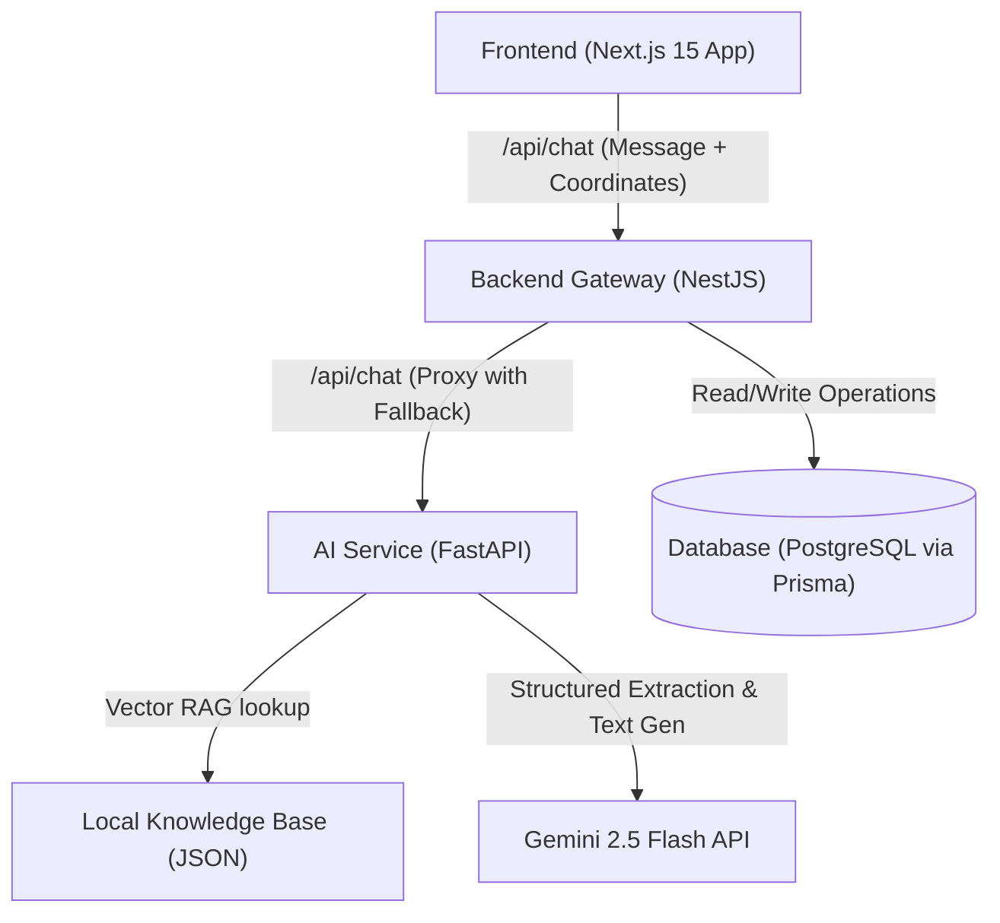

# Rakku – AI-Powered Digital Police Assistant (Prototype)

Rakku is an AI-powered conversational citizen-service assistant prototype designed for **Uttar Pradesh Police Citizen Services**. The assistant helps citizens discover digital services, understand procedures, and navigate workflows (Complaints, Tenant Verification, Character Certificates, Event Permissions) using natural language (supporting English, Hindi, and Hinglish).

It is designed to be fully integrated in the future with:
- UP Police Citizen Portal
- UPCOP Mobile App
- CCTNS (Crime and Criminal Tracking Network & Systems)
- Government e-Governance APIs

---

## Technical Architecture

The prototype is split into four decoupled layers to support scaling and seamless future migrations:



- **Frontend (`/frontend`):** Next.js 15 app built with TypeScript, Tailwind CSS, and Lucide React. Enforces automatic coordinates lookup and passes them with messages to the backend to support location mapping.
- **Backend Gateway (`/backend`):** NestJS gateway API utilizing Prisma ORM to save applications to a PostgreSQL database. Features a dedicated `ValidationService` validating name / mobile formats, input/output sanitization, and a local TypeScript-based fallback state machine that takes over if the Python AI service is offline.
- **AI Service (`/ai-service`):** FastAPI Python microservice running a slot-filling workflow state machine, Gemini structured information extraction layer, local RAG keyword search engine, and Gemini 2.5 Flash.
- **Database:** PostgreSQL database storing `Citizen` profiles, `WorkflowSession` states, complaints, verifications, certificates, permissions, and self-learning analytics.

---

## State Machine & Service Workflows

Rakku supports multiple conversational workflows, each collecting structured parameters via slot-filling state machine paths:

### 1. Citizen Profile Identification
Before entering a target workflow (except Tracking), Rakku verifies the citizen profile:
- **Name Check:** Accepts English & Hindi Unicode characters (e.g., `राज`, `मोहन सिंह`). Supports single-word names (e.g., `Rahul`). Rakku will suggest adding a surname but continues without blocking.
- **Mobile Check:** Requires and normalizes a 10-digit Indian mobile number (e.g., normalizes prefix `+91`, `91`, or leading `0`).
- **Geolocation Mapping:** If coordinate attributes (`latitude`/`longitude`) are present, Rakku prompts the user to confirm the auto-detected location (e.g., *"I found your location as: Lucknow. Is this correct?"*) with **Confirm** and **Change Location** options.
- **Natural Language Location Updates:** Users can update their location at any point using statements like *"I live in Kanpur"*, *"Change location to Varanasi"*, *"My district is Prayagraj"*, or *"Location is Noida"*.

### 2. Supported Active Workflows
* **Complaint Registration (`complaint`):**
  * **Fields:** Complaint Type (Lost Mobile, Lost Document, Simple Harassment, Cyber Fraud), Incident Location, Incident Date (DD/MM/YYYY), and Description.
  * **Lost Mobile / Theft Flow:** If the complaint type is `"Lost Mobile / Theft"`, the state machine appends additional hardware fields: Brand, Model, Color, Purchase Year, and IMEI Number. Prompts with guidance showing where to find the IMEI and accepts standard bypass inputs like `skip` or `not available` to proceed.
  * **Rejection Prevention:** Validates location consistency relative to profile location and checks for future/invalid dates.
  * **Reference Code:** Generates `UP-CMP-2026-XXXXXX`.
* **Tenant/PG/Help Verification (`verification`):**
  * **Fields:** Verification Type, Candidate Name, Permanent Address, Mobile Number, and Property Details.
  * **Reference Code:** Generates `UP-TV-2026-XXXXXX`.
* **Character Certificate (`certificate`):**
  * **Fields:** Applicant Name, Permanent Address, District, and Purpose.
  * **Reference Code:** Generates `UP-CC-2026-XXXXXX`.
* **Event Permission (`event`):**
  * **Fields:** Request Type, Event Name, Location/Route, Date, and Expected Attendance.
  * **Reference Code:** Generates `UP-EP-2026-XXXXXX`.
* **Application Tracking (`tracking`):**
  * **State Machine Bypass:** Direct read-only database lookup. It completely bypasses state workflows.
  * **Timeline Progress Visualizer:** Reads `statusHistory` JSON timeline array (e.g., `SUBMITTED` -> `UNDER_REVIEW` -> `APPROVED`) and renders an interactive vertical progress tracker.

---

## File Structure

```text
Rakku-chatbot-v1/
├── docker-compose.yml       # Orchestrates all services (DB, Backend, AI, Frontend)
├── .env.example             # Configuration file template
├── README.md                # Project documentation and API reference
│
├── frontend/                # Next.js 15 Web Portal
│   ├── src/
│   │   ├── app/
│   │   │   ├── admin/       # Analytics dashboard for tracking helplines and reports
│   │   │   ├── chat/        # ChatGPT-style digital assistant workspace
│   │   │   ├── components/  # Shared components (e.g. ThemeToggle)
│   │   │   ├── track/       # Application tracking portal with visual timeline
│   │   │   ├── globals.css  # CSS with UP Police navy/crimson/gold theme
│   │   │   ├── layout.tsx   # Global layouts and SEO metadata
│   │   │   └── page.tsx     # Modern government-style homepage with quick actions
│   │   └── services/
│   │       └── api.ts       # Decoupled citizen services API (ready for integrations)
│   ├── Dockerfile
│   └── package.json
│
├── backend/                 # NestJS Gateway API
│   ├── prisma/
│   │   └── schema.prisma    # Prisma PostgreSQL schema mapping
│   ├── src/
│   │   ├── main.ts          # NestJS entrypoint (CORS, Pipes, Prefix)
│   │   ├── app.module.ts    # Binds controllers and services
│   │   ├── prisma.service.ts
│   │   ├── complaint/       # Complaint service & REST controller
│   │   ├── verification/    # Tenant/PG/Domestic Help/Employee verification
│   │   ├── certificate/     # Character certificate service
│   │   ├── event/           # Event, Procession, Protest & Film permissions
│   │   ├── citizen-assistance/ # Nearest police lookup, helplines directory & analytics
│   │   ├── knowledge/       # vector search RAG items retrieval
│   │   ├── templates/       # Conversation responses (empathy, emergency notices)
│   │   ├── tracking/        # Unified status lookup service
│   │   └── chat/            # Chat fallback state machine (chat.service.ts, validation.service.ts)
│   ├── Dockerfile
│   └── package.json
│
└── ai-service/              # FastAPI AI Agent Service
    ├── main.py              # FastAPI app routing, stateless state parsing & health check
    ├── rag_engine.py        # Local JSON RAG matching retriever
    ├── workflow_engine.py   # Slot-filling state machine, profile validation & emergency checks
    ├── gemini_client.py     # Gemini structured profile extraction & prompt templates
    ├── knowledge_base.json  # Local citizen FAQs & official procedures
    ├── Dockerfile
    └── requirements.txt
```

---

## Core Features & Logic Design

### 1. Smart Emergency Intervention (112 Overrides)
Whenever the citizen mentions words related to immediate distress (e.g., *danger, assault, threat, weapon, murder, kidnapping, violence, suicide, मदद, खतरा, हमला, आग*), Rakku intercepts the conversation flow, cancels active slots, and sends an emergency notice directing them to dial **112** (UP Police Emergency Hotline).

### 2. Multi-Language Support (English, Hindi, Hinglish)
Intent classification is designed to handle multilingual prompts. Hindi and Hinglish inputs are answered with correctly localized responses matching their selected profile language instead of falling back to English.

### 3. Application Readiness Validation & Scoring
On completing any flow, Rakku displays the pre-submission review screen showing the checklist and **Readiness Score (0-100)**:
- **✓ Profile Valid** (25 pts)
- **✓ Mobile Valid** (25 pts)
- **✓ Location Confirmed** (25 pts)
- **✓ Required Fields Complete** (25 pts)

If any check fails, the score remains below 100, and Rakku blocks the submission option, requesting the citizen to correct or complete the missing fields.

### 4. Single Field Modification & Correction Layer
When a citizen reviews their details on the pre-submission summary card:
- Clicking `Modify Details` enters a sub-state flow (`MODIFY_SELECT` and `MODIFY_INPUT`).
- This allows changing a single field (e.g., changing the phone number or incident date) without forcing the citizen to restart the entire conversational form from scratch.

---

## Self-Learning & Citizen Intelligence Platform

Rather than automatically self-modifying its prompts or workflows, Rakku logs citizen interactions, feedback, sentiments, and intent patterns to generate actionable insights and recommendations for administrators.

### 1. Database Analytics Schema
The PostgreSQL database incorporates the following metrics and analytics models:
- **`ConversationInsight`**: Tracks query classification accuracy, intent confidence scores, and preferred user languages.
- **`ConversationSentiment`**: Logs sentiment metrics (positive, neutral, negative) mapped to conversation sessions.
- **`Feedback`**: Stores citizen satisfaction ratings (thumbs up/down) and qualitative feedback.
- **`UnansweredQuestion`**: Captures user queries that couldn't be answered to build new RAG knowledge articles.
- **`IntentTrainingData`**: Collects suggested training phrases for admin review.
- **`WorkflowAnalytics`**: Monitors workflow starts, steps completed, drop-offs, and completion times.

### 2. Admin Intelligence Portal
Accessible at `/admin` (or `/admin-intelligence`), the dashboard provides a modern web interface displaying:
- **Interactive Metrics Cards**: Conversational volumes, satisfaction rates, and average confidence scores.
- **Drop-off Funnel Analysis**: Funnel representation of slot-filling progress to isolate where citizens abandon workflows.
- **Unresolved & Hindi/Hinglish Query Reviews**: Visual listing of queries that require additional database or intent training.

---

## Quick Start (Docker Compose)

The easiest way to run the entire prototype (PostgreSQL, NestJS, FastAPI, and Next.js) is via Docker Compose:

### 1. How to Start Rakku
1. **Clone the repository** and open the root folder.
2. **Create a `.env` file** based on the `.env.example`:
   ```bash
   cp .env.example .env
   ```
3. **Configure your Gemini API Key** inside `.env`:
   ```env
   GEMINI_API_KEY=AIzaSy...
   ```
4. **Start the containers** in detached background mode:
   ```bash
   docker compose up -d --build
   ```
5. **Access the services:**
   - Next.js Web Portal: `http://localhost:3000`
   - NestJS Backend Gateway: `http://localhost:3001`
   - FastAPI AI Service: `http://localhost:8000/health`
   - PostgreSQL Database: `localhost:5432`

### 2. How to Stop Rakku
- **Stop containers (keeping data):**
  ```bash
  docker compose stop
  ```
- **Stop and remove containers/networks:**
  ```bash
  docker compose down
  ```
- **Stop and remove containers, networks, and database volumes (complete reset):**
  ```bash
  docker compose down -v
  ```

---

## Local Setup (Manual Run)

If you don't have Docker installed, you can start the Node.js services directly:

### 1. Database & NestJS Backend Setup
```bash
cd backend
npm install
# Configure DATABASE_URL in a local .env file
# Run Prisma migrations to initialize PostgreSQL
npx prisma db push --force-reset
# Generate prisma client types
npm run prisma:generate
# Start backend in development watch mode
npm run start:dev
```
*Runs at `http://localhost:3001`.*

### 2. Next.js Frontend Setup
```bash
cd frontend
npm install
# Start dev server
npm run dev
```
*Runs at `http://localhost:3000`.*

### 3. FastAPI AI Service Setup (Requires Python 3.10+)
```bash
cd ai-service
pip install -r requirements.txt
# Set GEMINI_API_KEY in environment or .env
uvicorn main:app --host 0.0.0.0 --port 8000 --reload
```
*Runs at `http://localhost:8000`.*

---

## API Reference

### 1. Chat Assistant Endpoint
* **`POST /api/chat`**
  * **Payload:** `{ "message": "My phone was stolen", "sessionId": "sess-abc", "latitude": 26.8467, "longitude": 80.9462 }`
  * **Response:** `{ "response": "📋 [Confirmation Card]... Is everything correct?", "suggestions": ["Confirm Details", "Modify Details"], "state": { ... } }`
